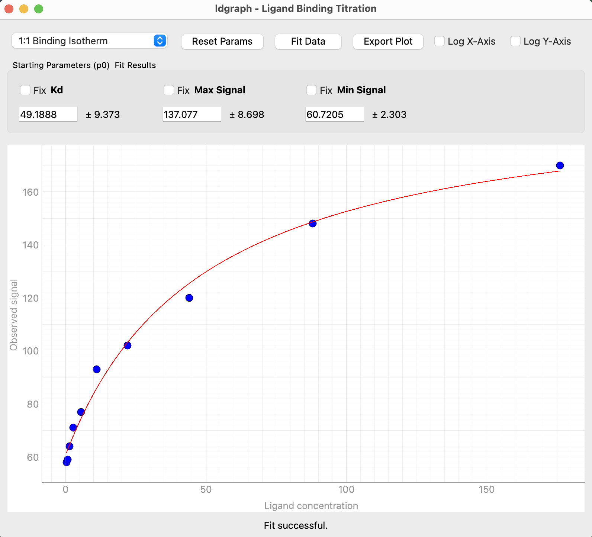

# ldgraph


### A simple fitting program. 


## Installation

```
pip install -e . 


ldgraph [file1.csv]
```

## Example Data
The `example/` directory contains a sample dataset that can be read in as a .csv or .txt file.

## Standalone MacOS App
Look in the **Releases** directory for standalone apps for both Intel and Apple Silicon computers.

## Screenshots

